### Image Similarity Model Development

This project focuses on building a robust image similarity model capable of handling diverse objects across a wide range of categories. Code walkthrough is avilable at https://www.loom.com/share/1b6e91bae06b49f48ef919dc93e5a44f?sid=dc53c024-72fa-48d6-b59a-c66d2b1b4816. Below is a summary of the development process and key approaches explored:

---

### **Approach 1: Triplet Loss with Feature Extraction**
- **Objective**: Ensure embeddings for elements of the same class are closer than embeddings for different classes.
- **Dataset**: Started with MNIST, then moved to CIFAR-10 and CIFAR-100.
- **Model**: Pretrained EfficientNet-B4 for feature extraction.
- **Loss Function**: Triplet loss.
- **Evaluation**: Used `mAP@k` (mean Average Precision at k) for k=1, 3, 5 on the validation set. Please check sheet at https://docs.google.com/spreadsheets/d/1dXESTKoIO415QRwjWKafGKkv258fKL6DIV1IEONEKxg/edit?usp=sharing
- **Observations**:
  - Achieved satisfactory results on MNIST and CIFAR-10.
  - Poor performance on CIFAR-100 highlighted the need for extensive experimentation with models, loss functions, and hyperparameters.

---

### **Approach 2: Classification + Embedding Proximity**
To address the limitations of triplet-loss-based training, a hybrid approach combining classification and embedding proximity was implemented.

#### **Steps**:
1. **Classification**: Classify the input image using a pretrained EfficientNet model.
   - ImageNet-1k: EfficientNet-B7 (1,000 classes).
   - ImageNet-22k: eva-02, trained on ImageNet-22k (22,000 classes in training, 12,000 in validation).
2. **Embedding Proximity**:
   - Generate CLIP embeddings for the validation images belonging to the predicted class.
   - Compute the distance between the test image embedding and the validation embeddings.
   - Retrieve the top 5 closest images as the similarity output.

#### **Results**:
- ImageNet-22k outperformed ImageNet-1k due to its broader range of object categories.
- Larger datasets demonstrated significant improvements in similarity predictions.

### Results

#### **Imagenet-1k**
Results using EfficientNet-B7 for classification and CLIP embeddings for similarity:

  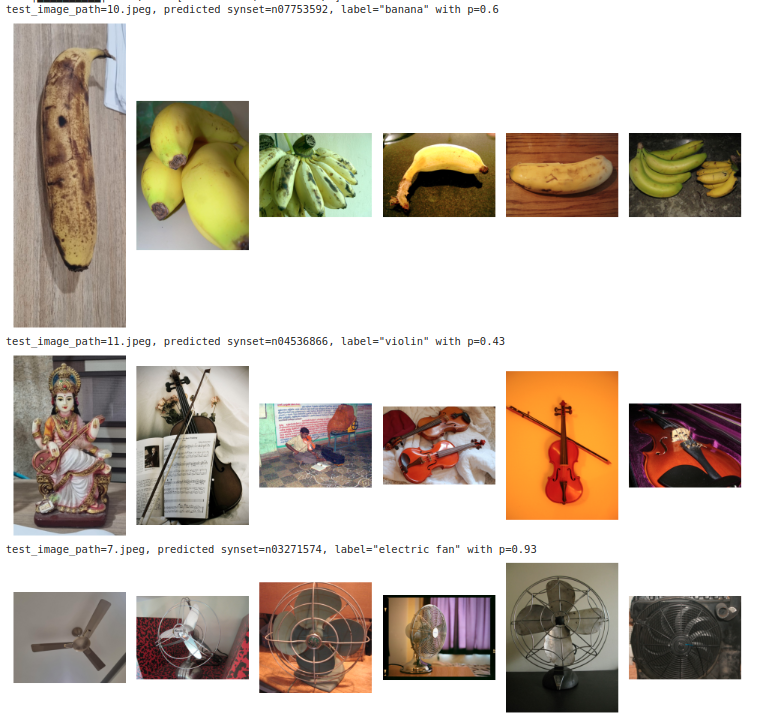
  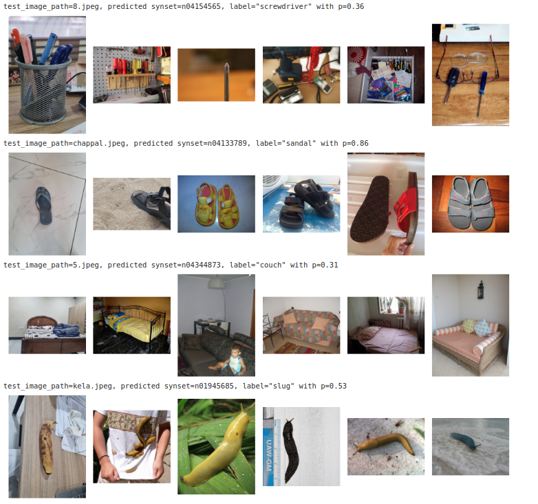
  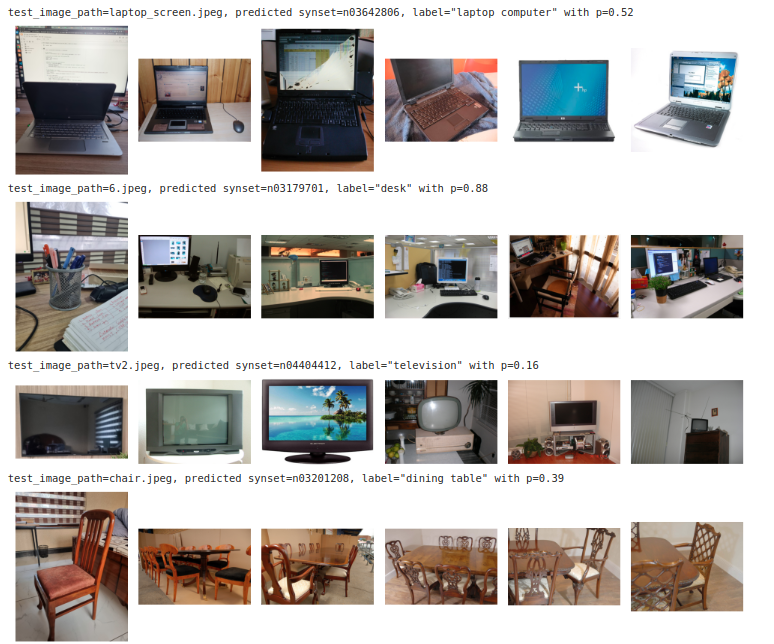
  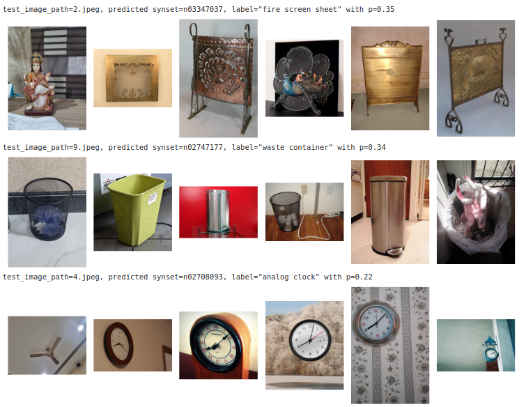
  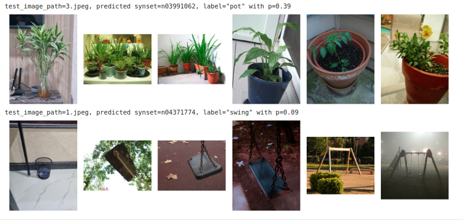

---

#### **Imagenet-22k**
Results using a model trained on Imagenet-22k for classification and CLIP embeddings for similarity:

  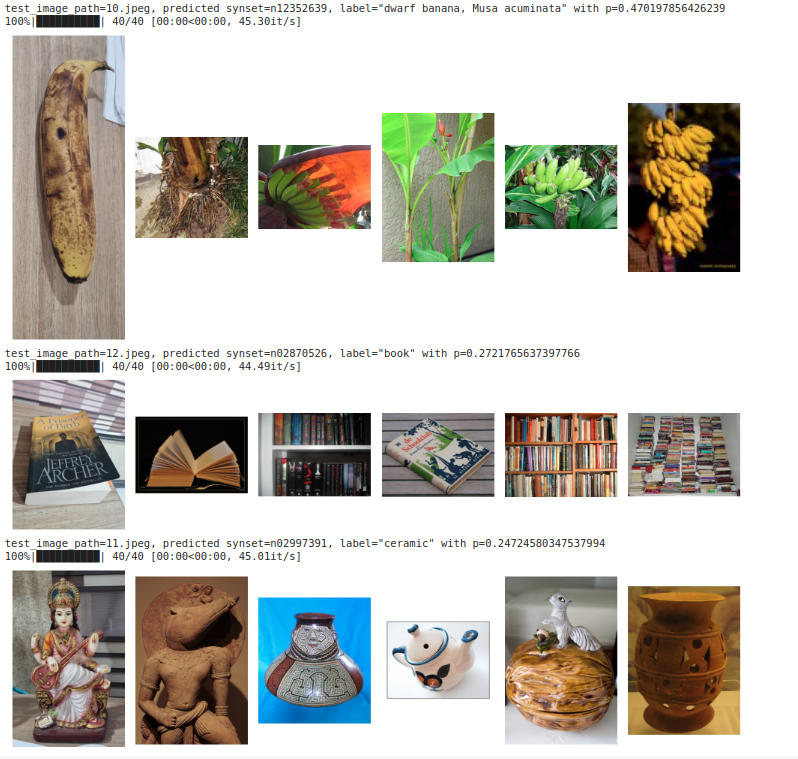
  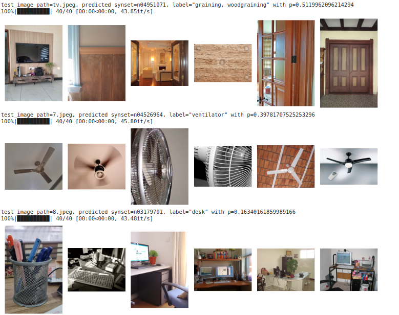
  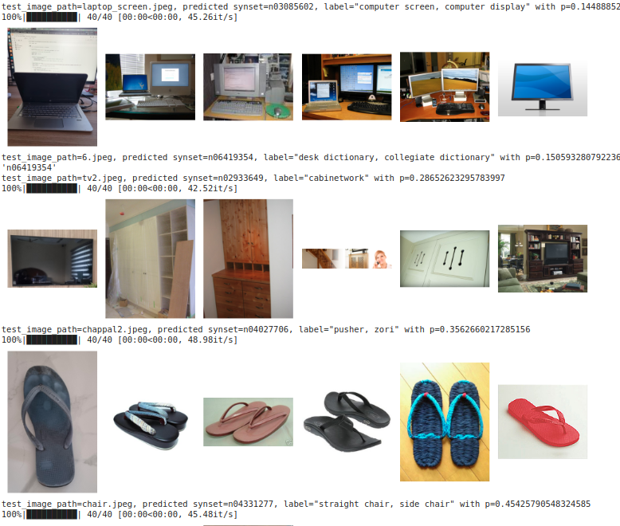
  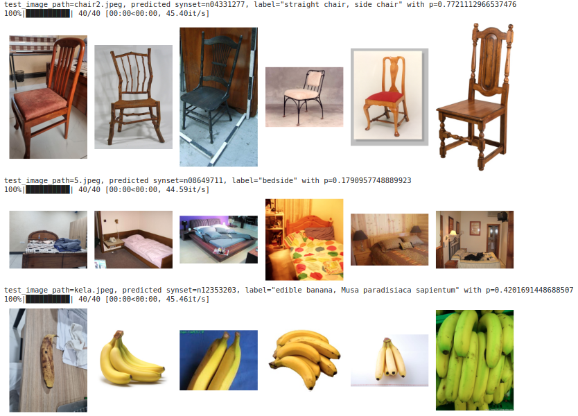
  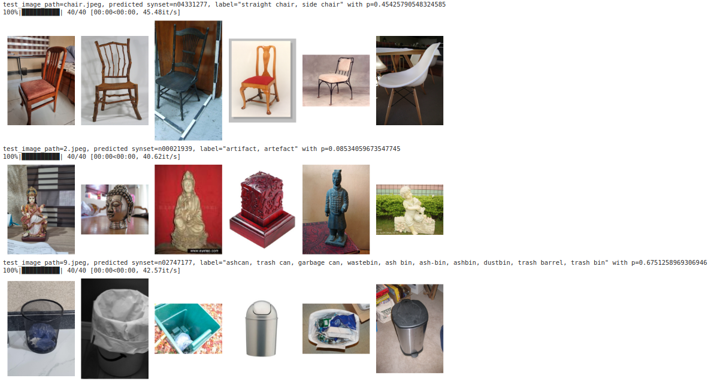
  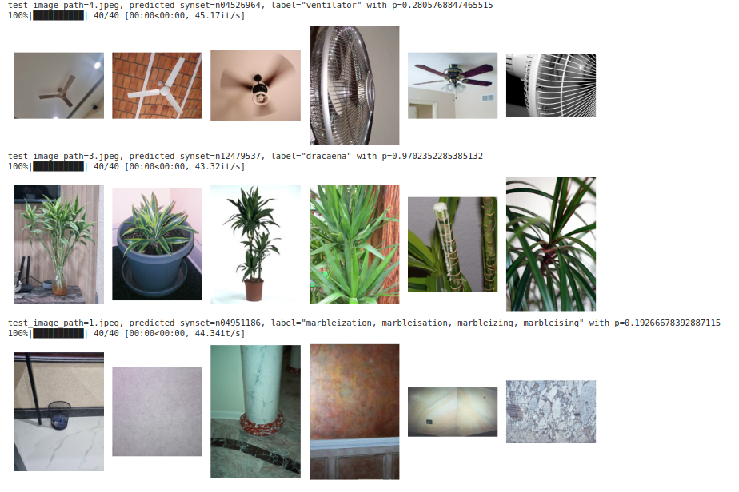

---

### **Experimentation with Object Detection**
- **Goal**: Improve results by focusing on specific regions of interest in the input image.
- **Method**:
  - Detect objects in the input image and crop to the largest bounding box near the center.
  - Perform image similarity on the cropped region.
- **Outcome**: Mixed results, with tight bounding boxes occasionally degrading performance.

---

### **Motivation for Using Large Datasets**
- **Reason**: A diverse dataset is essential for general-purpose image similarity tasks. 
- ImageNet datasets offer broad object coverage, making them suitable for this use case.
- Other datasets like Oxford5k and Paris5k are limited to specific categories (e.g., buildings), which restricts their applicability.

---

### **Future Directions**
- Explore additional datasets and models to further enhance similarity performance.
- Experiment with different loss functions and embeddings.
- Optimize object detection integration to improve focus on relevant image regions.

This project illustrates the challenges and iterative processes involved in creating a versatile image similarity model.